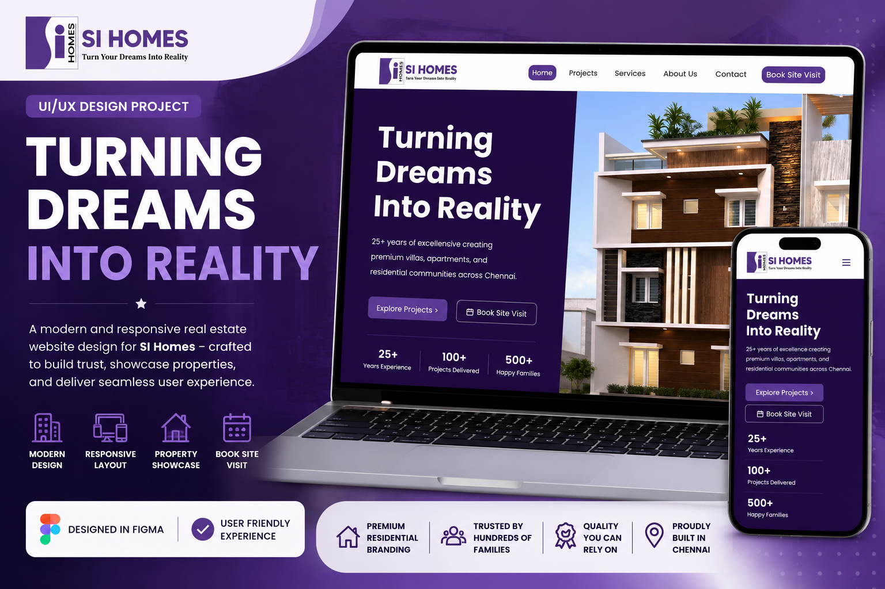
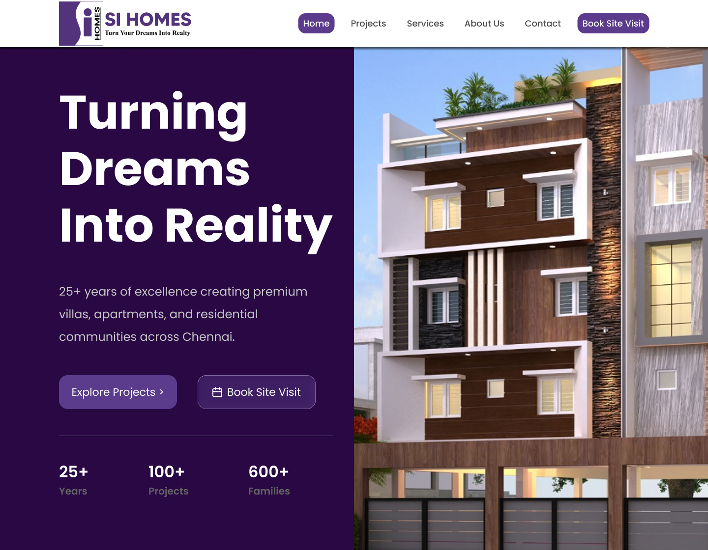
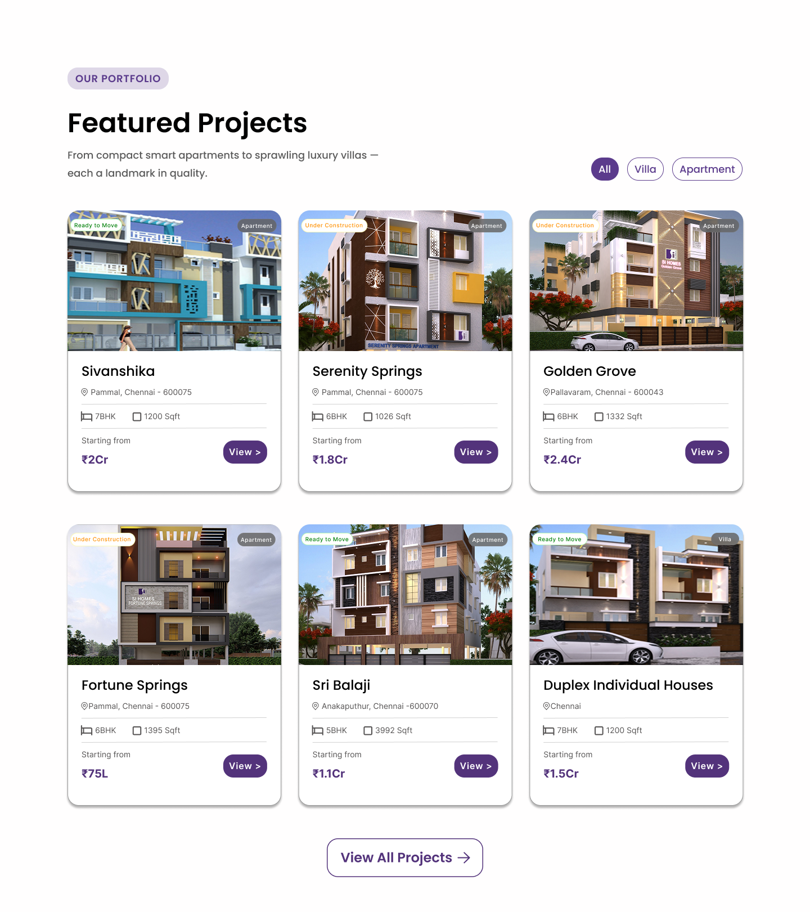
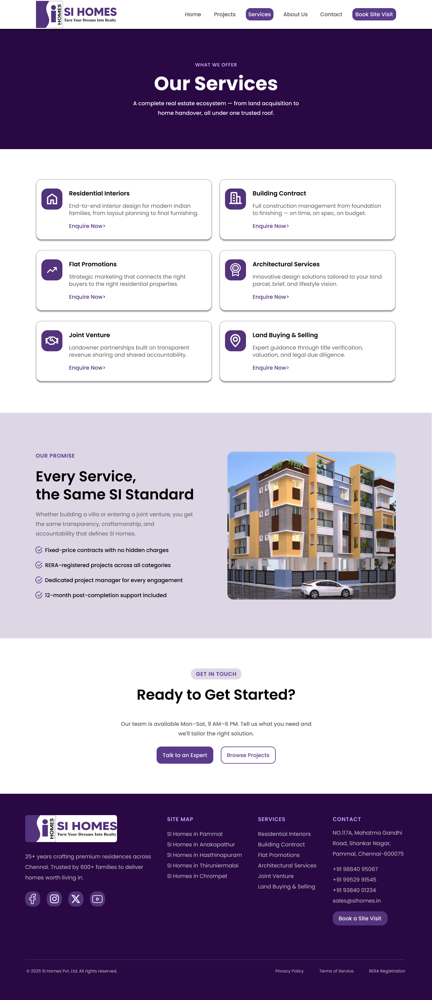
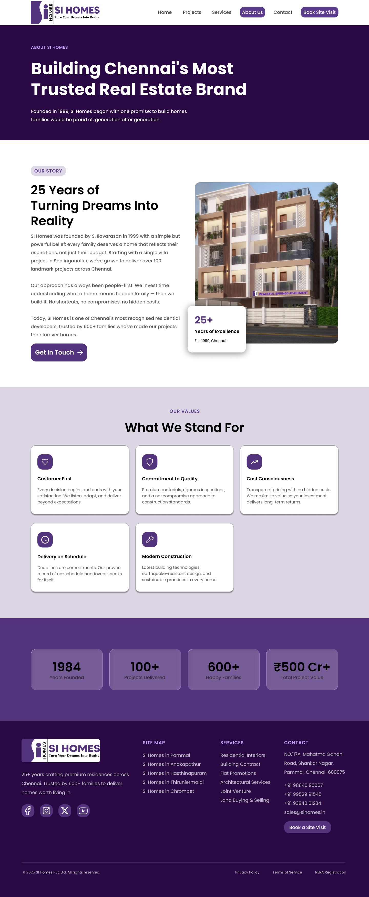
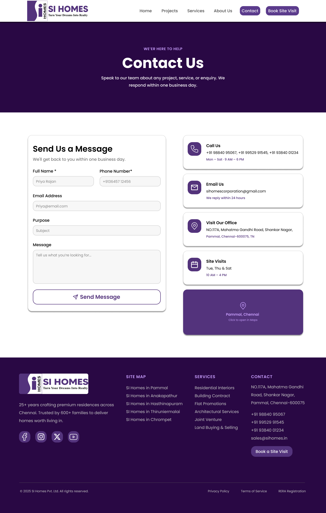

# 🏠 SI Homes – Real Estate Website UI/UX Design

## 📌 Project Overview

SI Homes is a modern and responsive real estate website UI/UX design created to showcase residential properties, communicate the brand's credibility, and provide users with a smooth property discovery experience.

The design focuses on modern visual aesthetics, responsive layouts, clear navigation, and a user-friendly experience across desktop and mobile devices.

## 🎯 Project Goal

The goal of this project was to create a professional digital experience for SI Homes that:

- Builds trust with potential customers
- Showcases residential properties clearly
- Provides easy access to services
- Makes booking a site visit simple
- Works across desktop and mobile devices

## 👥 Target Users

- Home buyers
- Families looking for residential properties
- Customers interested in villas and apartments
- People exploring residential communities
- Users interested in booking property site visits

## 🧠 Design Process

1. Understanding the business and target audience
2. Planning the website structure
3. User flow
4. Wireframing
5. High-fidelity UI design
6. Responsive desktop and mobile design
7. Final presentation and mockups

## 📱 Key Features

### 🏠 Home Page

- Brand introduction
- Property showcase
- Company experience
- Projects delivered
- Happy families
- Clear call-to-action buttons

### 🏘️ Projects

A dedicated section for users to explore SI Homes residential projects.

### 🛠️ Services

A clear presentation of the services offered by SI Homes.

### 👥 About Us

Information about the company, experience, and brand.

### 📅 Book Site Visit

A clear call-to-action for customers who want to visit a property.

## 📱 Responsive Design

The website was designed for:

- Desktop
- Laptop
- Tablet
- Mobile

The mobile design uses a responsive navigation menu, optimized content hierarchy, and touch-friendly controls.

## 🎨 Design Highlights

- Modern real estate visual style
- Purple-based brand identity
- Strong visual hierarchy
- Clean typography
- Responsive layouts
- Property-focused imagery
- Clear CTA buttons
- Consistent spacing and components

## 🛠️ Tools Used

- Figma
- Canva
- 
## 🔗 Figma Design

Add your Figma link here:

**[View Figma Design](https://www.figma.com/proto/lJPgkZHckllYvFOIarEW6k/SI-Homes--website-Design?node-id=2-3&p=f&t=JOgi8ZWcG4mCfhZr-1&scaling=min-zoom&content-scaling=fixed&page-id=0%3A1&starting-point-node-id=2%3A3)**

## 💡 Project Outcome

The final design provides SI Homes with a modern and responsive digital experience that combines strong branding, property presentation, and clear user journeys.

## 👨‍💻 Designed By

**Sanjai S**

UI/UX Designer

### Skills Demonstrated

- UI/UX Design
- Responsive Web Design
- Wireframing
- Prototyping
- Visual Design
- Figma
- User Experience Design

---

**Project Type:** UI/UX Design Case Study  
**Industry:** Real Estate  
**Platform:** Responsive Web  
**Design Tool:** Figma
